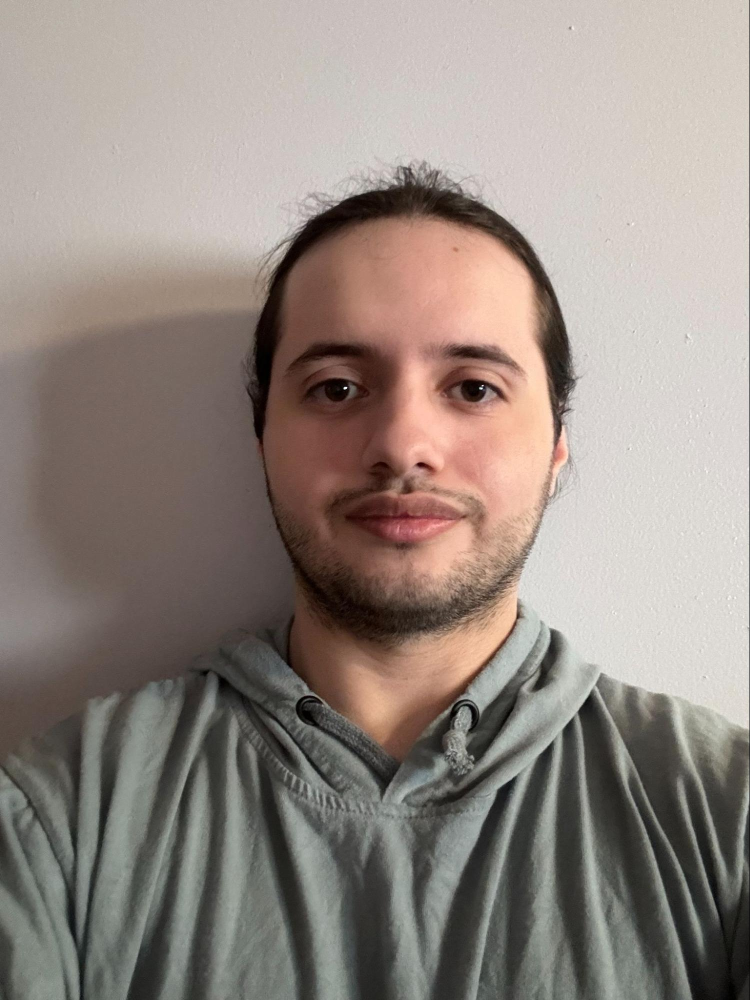

# chrisOli12.github.io

<html><head><meta content="text/html; charset=UTF-8" http-equiv="content-type"></head><body class="c5 doc-content">

<table class="c1"><tr class="c13"><td class="c3" colspan="1" rowspan="1">
Christopher Oliveira

College Sophmore

Computer Science &amp; Technology

Kean University

<a class="c9" href="https://www.google.com/url?q=https://github.com/chrisOli12/chrisOli12.github.io&amp;sa=D&amp;source=editors&amp;ust=1729630730131684&amp;usg=AOvVaw0kvZykIHotaq0f25lprN_C">Website</a>
</td><td class="c3" colspan="1" rowspan="1">

</td></tr></table>
I grew up playing video games, and I loved how they helped me when I was feeling down, I want to create games that will help people and bring them to another world away from whats bothering them for a while.

SKILLS:&nbsp;

Java, C++, DataStucture, Eclipse

PROJECTS:

Platformer Game: Javascript (Sept 2024 - present)

</body></html>
